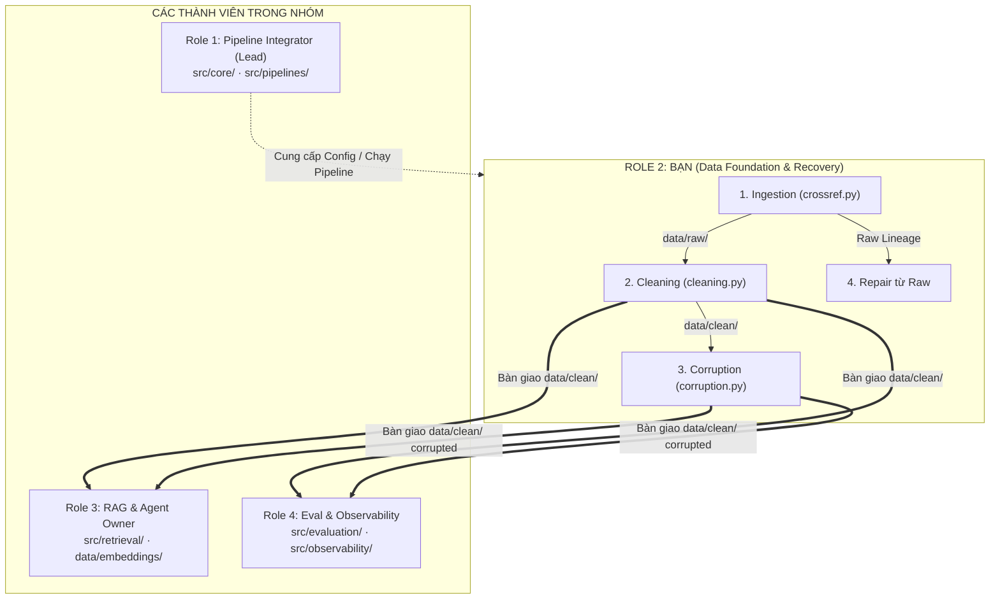

# BẢNG PHÂN CÔNG NHIỆM VỤ — VAI TRÒ 2 (ROLE 2)
> **Cấu hình nhóm:** Nhóm 4 thành viên  
> **Tên vai trò:** Data Foundation & Recovery Owner (Nền tảng dữ liệu & Recovery)  
> **Trích xuất từ:** `phan-cong-day-10-data-pipeline-4h(2).html`  
> **Lab:** Day 10 — Data Pipeline & Data Observability (4 Giờ)

---

## 1. Vị Trí Của Bạn Trong Nhóm 4 Người

Trong mô hình 4 người, bạn phụ trách toàn bộ **tầng dữ liệu (Data Layer)** từ lúc cào raw cho đến khi làm sạch, tạo lỗi (corruption) và phục hồi (repair):



### 🤝 Ma trận phối hợp (Handoff) giữa bạn và đồng đội:
- **Với Role 1 (Lead):** Chốt format `Settings`, schema và các path output; báo cáo số lượng row (raw count → clean count).
- **Với Role 3 (RAG Owner):** Bàn giao `data/clean/` có cột `text_for_embedding` và `paper_id` stable để Role 3 build ChromaDB index (`papers-baseline`, `papers-corrupted`, `papers-repaired`).
- **Với Role 4 (Eval & Observability):** Bàn giao clean dataframe để Role 4 tạo bộ câu hỏi `test_set.json` và chạy kiểm tra Data Quality & Freshness.

---

## 2. Quy Tắc Bắt Buộc Xuyên Suốt Lab
1. **Chỉ chạy corruption** sau khi baseline đã tạo đầy đủ artifact (`data/clean/`, `data/embeddings/`, `baseline_metrics.json`).
2. **Không ghi đè baseline:** Dùng đường dẫn và tên file/collection riêng cho 3 trạng thái: `baseline`, `corrupted`, `repaired`.
3. **Repair từ nguồn raw chuẩn:** Khôi phục bằng cách chạy lại cleaning logic từ raw records, tuyệt đối không sửa tay (manual edit) answers hoặc metrics.
4. **Mọi filter/drop phải có log:** Bất kỳ record nào bị loại bỏ phải có lý do và đếm số lượng (count).
5. **Bảo mật:** Không commit file `.env` hoặc API key lên Git.

---

## 3. Checklist & Lộ Trình Chi Tiết 7 Checkpoint (CP0 – CP6)

```
00:00        00:30        01:05        01:35        02:00     02:15        03:15        04:00
  |--- CP0 ----|--- CP1 ----|--- CP2 ----|--- CP3 ----|- CP4 -|--- CP5 ----|--- CP6 ----|
    Khởi động    Cleaning     Test set     Baseline     Nghỉ     Corruption   Repair &
    & Ingestion  & Contract   & Smoke test End-to-End   15'      & Đo impact  Demo so sánh
```

---

### ⏱️ CHECKPOINT 0 (00:00 – 00:30) · Khởi động, contract & Ingestion raw
- **Thời lượng:** 30 phút
- **Lệnh kiểm tra:** `ls data/raw` *(sau lần fetch đầu tiên)* hoặc `rg -n "TODO\(student\)|NotImplementedError" src`
- **Tiêu chí hoàn thành (Pass):** Raw response và raw records JSON tồn tại trong `data/raw/`; `PaperRecord` có stable `paper_id`; nắm rõ artifact bàn giao.
- **Checklist công việc của Role 2:**
  - [ ] Đọc payload mẫu của Crossref API và dataclass/model `PaperRecord`.
  - [ ] Xác định trường dữ liệu để tạo stable `paper_id` (không đổi giữa các lần chạy).
  - [ ] Implement `parse_crossref_payload` trong [src/ingestion/crossref.py](file:///var/home/nguyenhuucong/PycharmProjects/K4_Day10_Data-Pipeline-Data-Observability-B1-2/src/ingestion/crossref.py).
  - [ ] Lưu raw API response và parsed raw records vào `data/raw/`.
  - [ ] Thêm cơ chế retry / backoff khi gặp lỗi mạng hoặc HTTP 429/503.
  - [ ] Đọc target clean schema; thống nhất rule xử lý null, date, duplicate, authors/categories.
  - [ ] Xác định các trường cần thiết để build `text_for_embedding` và `age_days`.
- **⚠️ Lưu ý:** *Nếu API Crossref chập chờn, dùng retry/backoff; không bỏ raw response hoặc thay bằng dữ liệu bịa.*

---

### ⏱️ CHECKPOINT 1 (00:30 – 01:05) · Cleaning, data model & quality gates
- **Thời lượng:** 35 phút
- **Lệnh kiểm tra:** `ls data/clean`
- **Tiêu chí hoàn thành (Pass):** File clean CSV/JSON đọc được; `paper_id` là unique; có đủ `text_for_embedding` và `age_days`; truy vết được số lượng/lý do record bị loại.
- **Checklist công việc của Role 2:**
  - [ ] Đối chiếu raw snapshot với `PaperRecord` đã parse; truy vết các DOI/ID lỗi.
  - [ ] Xác minh raw records có đủ các trường để bước cleaning không phải đoán dữ liệu.
  - [ ] Implement các hàm làm sạch trong [src/ingestion/cleaning.py](file:///var/home/nguyenhuucong/PycharmProjects/K4_Day10_Data-Pipeline-Data-Observability-B1-2/src/ingestion/cleaning.py):
    - Chuẩn hóa text: `title`, `summary`, `authors`, `categories`.
    - Parse ngày xuất bản (`published`).
    - Deduplicate theo stable `paper_id`.
    - Tính toán `age_days` (độ tươi mới của paper).
    - Tạo trường tổng hợp `text_for_embedding`.
  - [ ] Lưu cleaned dataframe ra `data/clean/`.
  - [ ] Bàn giao đường dẫn `data/clean/` và sample record cho Role 3 và Role 4.
- **⚠️ Lưu ý:** *Mọi filter và dedupe phải để lại log hoặc count: không được làm mất record âm thầm.*

---

### ⏱️ CHECKPOINT 2 (01:05 – 01:35) · Test set, RAG index & agent smoke test
- **Thời lượng:** 30 phút
- **Lệnh kiểm tra:** `find data -maxdepth 2 -type f | sort`
- **Tiêu chí hoàn thành (Pass):** `test_set.json`, embedding manifest và collection baseline tồn tại; semantic search và exact lookup đều trả về kết quả có nguồn.
- **Checklist công việc của Role 2:**
  - [ ] Kiểm tra 1 `paper_id` xuyên suốt cả 3 tầng: `raw` → `clean` → `index metadata`.
  - [ ] Xác minh không còn record nào có `text_for_embedding` rỗng hoặc `paper_id` bị trùng lặp.
  - [ ] Hỗ trợ Role 4 review các record được đưa vào `test_set.json` đảm bảo nội dung chuẩn xác.
  - [ ] Cung cấp source evidence (bằng chứng từ raw) nếu evaluator hoặc agent trả lời sai lệch.
  - [ ] Không tự ý refresh/cào lại source giữa chừng làm thay đổi baseline.
- **⚠️ Lưu ý:** *Nếu smoke test không tìm thấy tài liệu, sửa contract clean/index trước; không chuyển sang evaluation bằng collection lỗi.*

---

### ⏱️ CHECKPOINT 3 (01:35 – 02:00) · Baseline end-to-end & báo cáo
- **Thời lượng:** 25 phút
- **Lệnh kiểm tra:** `uv run python script/run_phase1.py`
- **Tiêu chí hoàn thành (Pass):** `baseline_metrics.json`, answers, quality/freshness report và `phase1_report.md` tạo thành công.
- **Checklist công việc của Role 2:**
  - [ ] Kiểm tra lại các file trong `data/raw/` và `data/clean/` đảm bảo format chuẩn.
  - [ ] So sánh `raw count` vs `clean count`; giải thích rõ số lượng record bị drop và lý do.
  - [ ] Đảm bảo script baseline chạy mượt mà từ file raw đã lưu, không gọi lại API ngoài ý muốn.
  - [ ] Kiểm tra các tín hiệu quality check (của Role 4) phản ánh đúng dữ liệu thật, không hard-code.
- **⚠️ Lưu ý:** *Baseline chỉ hoàn tất khi artifacts, metrics và report khớp nhau — không chỉ nhìn vào exit code 0.*

---

### ☕ CHECKPOINT 4 (02:00 – 02:15) · Nghỉ giải lao 15 phút
- **Thời lượng:** 15 phút
- **Lệnh kiểm tra:** `cat data/results/baseline_metrics.json`
- **Tiêu chí hoàn thành:** Nghỉ đủ 15 phút; quay lại với kịch bản corruption đã chọn sẵn (loại lỗi, record nhắm đến, cách repair).
- **Checklist công việc của Role 2:**
  - [ ] Nghỉ ngơi giải lao 15 phút.
  - [ ] Chuẩn bị sẵn ý tưởng corruption trên clean data và cách dùng raw source làm điểm khôi phục (recovery point).

---

### ⏱️ CHECKPOINT 5 (02:15 – 03:15) · Corruption có kiểm soát & đo impact
- **Thời lượng:** 60 phút
- **Lệnh kiểm tra:** `uv run python script/run_corruption_flow.py`
- **Tiêu chí hoàn thành (Pass):** Corruption log, corrupted clean / index / answers / metrics / quality và report có đầy đủ; baseline nguyên vẹn.
- **Checklist công việc của Role 2:**
  - [ ] Xác nhận raw source nguyên vẹn trước khi corrupt clean data.
  - [ ] Implement hàm `corrupt_clean_dataframe` trong [src/ingestion/corruption.py](file:///var/home/nguyenhuucong/PycharmProjects/K4_Day10_Data-Pipeline-Data-Observability-B1-2/src/ingestion/corruption.py):
    - ❌ Blank summary (làm rỗng tóm tắt).
    - ❌ Drop latest records (xóa các bài báo mới nhất).
    - ❌ Add noise vào summary (thêm văn bản rác).
    - ❌ Truncate title (cắt cụt tiêu đề).
    - ❌ Stale published date (làm cũ ngày xuất bản).
    - ❌ Add duplicate rows (chèn bản ghi trùng lặp).
  - [ ] Ghi lại log chi tiết: Record ID nào bị sửa, loại lỗi gì, tham số, số lượng row trước/sau.
  - [ ] Lưu corrupted clean data vào đường dẫn riêng (vd: `data/clean/papers_corrupted.parquet` hoặc `.csv`).
  - [ ] Bàn giao corrupted dataset cho Role 3 (build index `papers-corrupted`) và Role 4 (đo metric sụt giảm).
- **⚠️ Lưu ý:** *Lỗi dữ liệu phải có chủ đích, có log và đo được tác động rõ ràng; không tạo lỗi ngẫu nhiên khó kiểm chứng.*

---

### ⏱️ CHECKPOINT 6 (03:15 – 04:00) · Repair từ raw, comparison, review & demo
- **Thời lượng:** 45 phút
- **Lệnh kiểm tra:** `ls data/results/repaired_metrics.json data/reports/corruption_report.md`
- **Tiêu chí hoàn thành (Pass):** Repaired artifacts và comparison report có đầy đủ số liệu 3 trạng thái + delta; repo sạch secret; demo bằng artifact thật.
- **Checklist công việc của Role 2:**
  - [ ] Nạp lại (Reload) raw records đúng snapshot gốc đã dùng ở baseline.
  - [ ] Chạy lại quy trình clean chuẩn từ raw để sinh ra bộ dữ liệu đã phục hồi (`repaired dataset`).
  - [ ] Chứng minh các record bị lỗi/drop ở CP5 đã được khôi phục nguyên vẹn dựa trên raw lineage.
  - [ ] Bàn giao `repaired dataset` cho Role 3 (build index `papers-repaired`) và Role 4 (đo metric phục hồi).
  - [ ] Phối hợp với nhóm trình bày (demo) sự khác biệt dữ liệu giữa 3 trạng thái: `clean` ➔ `corrupted` ➔ `repaired`.
- **⚠️ Lưu ý:** *Ưu tiên evidence: tuyệt đối không copy sửa tay từ baseline, phải chạy lại pipeline repair thực sự.*

---

## 4. Bảng File Code & Artifacts Role 2 Quản Lý

| Loại tài nguyên | File / Thư mục | Nhiệm vụ chính |
| :--- | :--- | :--- |
| **Code: Ingestion** | [src/ingestion/crossref.py](file:///var/home/nguyenhuucong/PycharmProjects/K4_Day10_Data-Pipeline-Data-Observability-B1-2/src/ingestion/crossref.py) | Fetch Crossref API, parse payload, sinh `paper_id` stable, retry logic |
| **Code: Cleaning** | [src/ingestion/cleaning.py](file:///var/home/nguyenhuucong/PycharmProjects/K4_Day10_Data-Pipeline-Data-Observability-B1-2/src/ingestion/cleaning.py) | Normalize text, deduplicate, sinh `text_for_embedding`, `age_days`, filter logs |
| **Code: Corruption** | [src/ingestion/corruption.py](file:///var/home/nguyenhuucong/PycharmProjects/K4_Day10_Data-Pipeline-Data-Observability-B1-2/src/ingestion/corruption.py) | Tạo lỗi có chủ đích (missing, noise, drop, duplicate, stale date) + ghi log |
| **Data: Raw** | `data/raw/` | Chứa snapshot raw response & raw records JSON |
| **Data: Clean** | `data/clean/` | Chứa 3 file dataset: `baseline`, `corrupted`, `repaired` |
